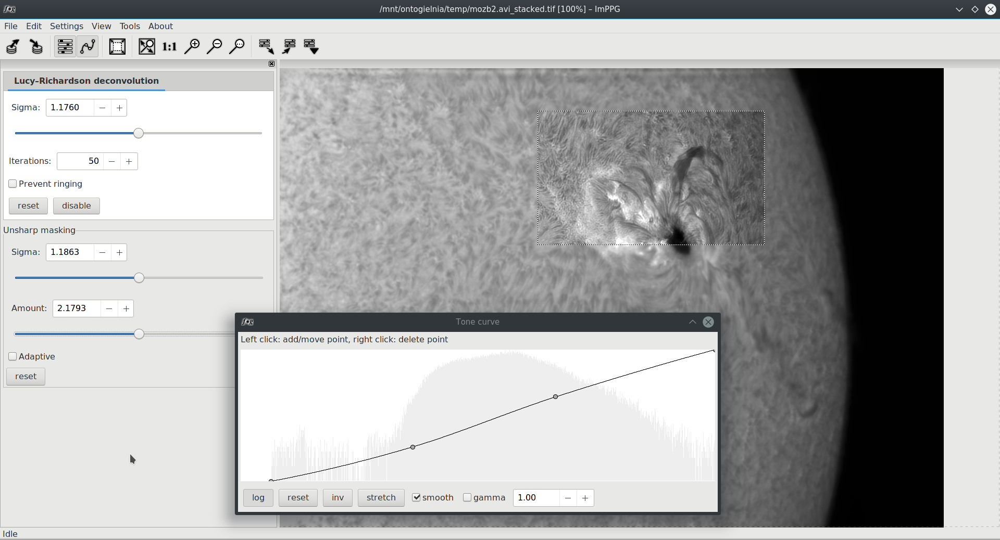

# ImPPG (Image Post-Processor)
Copyright (C) 2015-2025 Filip Szczerek (ga.software@yahoo.com)

wersja 2.0.0 (2025-01-30)

*Niniejszy program ABSOLUTNIE nie jest objęty JAKĄKOLWIEK GWARANCJĄ. Jest to wolne oprogramowanie na licencji GNU GPL w wersji 3 (lub dowolnej późniejszej) i można je swobodnie rozpowszechniać pod pewnymi warunkami: zob. pełny tekst licencji w pliku LICENSE.*

(kodowanie tego pliku: UTF-8)

----------------------------------------

- 1\. Wprowadzenie
  - 1\.1\. Tryb przetwarzania/wyświetlania (back end)
- 2\. Interfejs użytkownika
- 3\. Obsługiwane formaty graficzne
- 4\. Przetwarzanie obrazów
  - 4\.1\. Normalizacja jasności
  - 4\.2\. Dekonwolucja Lucy-Richardson
  - 4\.3\. Unsharp masking
  - 4\.4\. Krzywa tonalna
- 5\. Zapisywanie/wczytywanie ustawień
- 6\. Przetwarzanie wsadowe (wielu plików)
- 7\. Wyrównywanie sekwencji obrazów
  - 7\.1\. Stabilizacja kontrastowych obszarów (korelacja fazowa)
  - 7\.2\. Stabilizacja krawędzi tarczy słonecznej
- 8\. Obsługa skryptów
- 9\. Pozostałe
- 10\. Znane problemy
- 11\. Pobieranie
- 12\. Budowanie ze źródeł
  - 12\.1\. Budowanie w systemie Linux i podobnych z użyciem narzędzi GNU (lub kompatybilnych)
    - 12\.1\.1. Budowanie pod Ubuntu
    - 12\.1\.2. Budowanie pod Fedorą
    - 12\.1\.3. Tworzenie pakietów (Linux)
    - 12\.1\.4. Budowanie pod macOS
  - 12\.2\. Budowanie pod MS Windows
  - 12\.3\. Język UI
- 13\. Podziękowania
- 14\. Historia zmian

----------------------------------------

## Strona WWW projektu: https://greatattractor.github.io/imppg/




----------------------------------------
## 1. Wprowadzenie

ImPPG (*Image Post-Processor*) dokonuje typowych operacji obróbki obrazu, w poniższej kolejności:

  - normalizacja poziomu jasności
  - dekonwolucja Lucy-Richardson z ustalonym kernelem gaussowskim
  - wygładzanie lub wyostrzanie metodą unsharp masking
  - zmiana krzywej tonalnej

(wszystkie kroki są opcjonalne). Przetwarzanie odbywa się z użyciem arytmetyki zmiennoprzecinkowej pojedynczej precyzji (32 bity). Ustawienia wszystkich powyższych etapów można zapisać w pliku i użyć do przetwarzania wsadowego wielu obrazów.

ImPPG umożliwia również wyrównanie sekwencji obrazów, które mogą być znacznie przesunięte względem siebie w przypadkowy sposób. Funkcja ta może by przydatna np. do przygotowania animacji poklatkowej Słońca, gdzie kolejne klatki uległy przesunięciu wskutek niedokładnego prowadzenia montażu teleskopu. Inne możliwe zastosowania to wygładzanie animacji poklatkowych krajobrazu lub przygotowanie surowych klatek (z dużymi drganiami obrazu) do stackowania.

Wyrównywanie (z subpikselową dokładnością) odbywa się metodą korelacji fazowej (która automatycznie dopasowuje do siebie najbardziej kontrastowe obszary) lub poprzez wykrywanie i stabilizację krawędzi tarczy słonecznej.


----------------------------------------
### 1.1. Tryb przetwarzania/wyświetlania (back end)

Poczynając od wersji 0.6.0, ImPPG zawiera dwa back endy: "CPU + bitmapy" oraz "GPU (OpenGL)". Domyślnie włączony jest ten drugi; realizuje przetwarzanie obrazów (oprócz wyrównywania sekwencji) oraz przewijanie i skalowanie podglądu w całości na GPU. Na większości komputerów jest co najmniej kilkakrotnie szybszy od back endu CPU.

Back endy można przełączyć za pomocą menu `Ustawienia/Back end`.


----------------------------------------
## 2. Interfejs użytkownika

  - Panel elementów kontrolnych sterujących obróbką, początkowo zadokowany po lewej stronie okna głównego, może zostać odłączony lub zadokowany po prawej stronie.

  - Panel sterujący obróbką oraz okno edytora krzywej tonalnej mogą zostać zamknięte i przywrócone poleceniami z menu `Widok` lub przyciskami paska narzędziowego.

  - Zmiany ustawień dekonwolucji L-R, unsharp maskingu i krzywej tonalnej wpływają tylko na bieżące zaznaczenie (ograniczone wykropkowaną lub oznaczoną odwróconym poziomem jasności ramką). By zastosować je do całego obrazu, należy użyć funkcji `Zaznacz (i poddaj obróbce) wszystko` z menu `Edycja` lub odpowiedniego przycisku z paska narzędziowego.

  - Bieżące zaznaczenie można zmienić w każdej chwili przeciągając myszą z wciśniętym lewym przyciskiem. Zmiana zaznaczenia przerywa rozpoczęte już przetwarzanie (o ile było w toku).

  - Im mniejszy zaznaczony obszar, tym szybciej przebiega obróbka. Do precyzyjnej regulacji *sigmy* dekonwolucji L-R zaleca się zaznaczenie w miarę małego obszaru; dzięki temu efekty poruszania suwakiem *sigmy* będą widoczne prawie natychmiastowo. Odświeżanie jest nieco wolniejsze, gdy bieżące powiększenie jest różne od 100%.

  - Powiększenie widoku można zmieniać przyciskami paska narzędziowego, pozycjami w menu `Widok` bądź kółkiem myszy.

  - Widok można przewijać przeciągając go z wciśniętym środkowym lub prawym przyciskiem myszy.

  - Wielkość ikon narzędziowych można zmienić w menu `Ustawienia`.


----------------------------------------
## 3. Obsługiwane formaty graficzne

Akceptowane formaty wejściowe: BMP, JPEG, PNG, TIFF (większość głębi bitowych i metod kompresji), TGA i inne poprzez bibliotekę FreeImage, FITS. Przetworzony obraz zapisywany jest w jednym z formatów: BMP 8-bitowy, PNG 8-bitowy, TIFF 8-bitowy, 16-bitowy, 32-bitowy zmiennoprzecinkowy (bez kompresji bądź z kompresją LZW lub ZIP), FITS 8-, 16-, 32-bitowy zmiennoprzecinkowy.

Obrazy wyjściowe po użyciu funkcji wyrównywania sekwencji zapisywane są w formacie TIFF (bez kompresji) z zachowaniem liczby kanałów i głębi bitowej (oprócz 8-bitowych z paletą; te zostaną skonwertowane na 24-bitowe RGB). Pliki wejściowe FITS zapisywane są jako FITS o takiej samej głębi bitowej.


----------------------------------------
## 4. Przetwarzanie obrazów

Ilustrowany samouczek dostępny jest pod adresem http://greatattractor.github.io/imppg/tutorial/tutorial_en.html

----------------------------------------
### 4.1. Normalizacja jasności

ImPPG jest w stanie sprowadzić poziom jasności obrazu wejściowego (przed wszystkimi pozostałymi etapami obróbki) do zadanego przez użytkownika zakresu od `min` do `max` (wartości w procentach maksymalnej jasności; 0% = czarny, 100% = biały). Najciemniejsze piksele wejściowe otrzymują wartość `min`, najjaśniejsze: wartość `max`.

Zarówno `min` jak i `max` mogą być mniejsze niż 0% i większe niż 100% (może to spowodować obcięcie histogramu). Dopuszczalne jest również, by `max` była mniejsza od `min`; wówczas poziomy jasności zostaną odwrócone (obraz stanie się negatywem; można to również osiągnąć edytując krzywą tonalną, zob. 4.4).

Normalizacja może być przydatna podczas obróbki sekwencji astronomicznych „stacków” zarejestrowanych w czasie zmiennej przejrzystości powietrza (zatem z różnymi poziomami jasności).

Dostęp:
    menu: `Ustawienia`/`Normalizacja poziomu jasności...`


----------------------------------------
### 4.2. Dekonwolucja Lucy-Richardson

ImPPG wyostrza obrazy stosując dekonwolucję Lucy-Richardson z ustalonym kernelem gaussowskim. Szerokość kernela dana jest *sigmą* funkcji Gaussa; zwiększanie jej sprawia, że ostrzenie jest bardziej gruboziarniste.

Zalecana liczba iteracji dekonwolucji: 30 do 70. Wartość 0 wyłącza dekonwolucję L-R.

Przełącznik `Ogranicz ringing` aktywuje eksperymentalną funkcję redukcji *ringingu* (halo) wokół prześwietlonych (jednolicie białych) obszarów (np. tarczy słonecznej na obrazie protuberancji), powodowanego przez wyostrzanie.

Dostęp:
    zakładka `Dekonwolucja Lucy-Richardson` na panelu kontrolnym (po lewej stronie okna głównego)


----------------------------------------
### 4.3. Unsharp masking

Unsharp masking służy do końcowego wyostrzania (niezależnie od dekonwolucji L-R) lub wygładzania obrazu. Parametr `sigma` określa szerokość kernela gaussowskiego; im większa wartość, tym bardziej gruboziarniste ostrzenie/wygładzanie. `Poziom` reguluje natężenie efektu. Wartość < 1 wygładza, 1 pozostawia obraz bez zmian, wartość > 1 wyostrza.

Można stworzyć więcej niż jedną maskę; będą zastosowane do obrazu w sposób sekwencyjny. Przykładowo, pierwsza maska może wyostrzać (poziom > 1), a druga (z mniejszą sigmą) lekko rozmywać (poziom < 1) obraz w celu usunięcia szumu.

#### Tryb adaptatywny

W trybie tym `poziom` jest zmienny i zależy od jasności (nieprzetworzonego) obrazu wejściowego. Dla obszarów ciemniejszych niż `próg − szerokość granicy` przybiera on wartość `poziom min.`, dla jaśniejszych niż `próg + szerokość granicy`: `poziom max.`. Pomiędzy nimi `poziom` zmienia się płynnie od `poziom min.` do `poziom max.`.

Przykładowa sytuacja, gdzie tryb adaptatywny może być przydatny, to „wyciąganie” słabych protuberancji słonecznych poprzez manipulację krzywą tonalną. Zazwyczaj podkreśli to również szum w obrazie (zwłaszcza gdy użyto dekonwolucji L-R), jako że ciemniejsze obszary cechują się mniejszym stosunkiem sygnału do szumu. Ustawiając dla `poziom max.` wartość wyostrzającą (>1,0) odpowiednią dla wnętrza tarczy słonecznej, ale wartość 1,0 (tj. brak wyostrzania) dla `poziom min.` oraz `próg` wypadający w strefie przejściowej między tarczą a warstwą protuberancji, zapewnimy, że protuberancje i tło nie będą dodatkowo wystrzone. Można je wręcz wygładzić ustawiając `poziom min.` poniżej 1,0 (tarcza pozostanie wyostrzona).

Dopuszczalne jest również ustawienie `poziom min.` > `poziom max.`.

Dostęp:
    ramka `Unsharp masking` na panelu kontrolnym (po lewej stronie okna głównego)


----------------------------------------
### 4.4. Krzywa tonalna

Edytor krzywej tonalnej umożliwia zmianę odwzorowania wejściowych poziomów jasności w wyjściowe. Krzywa tonalna aplikowana jest dopiero po wszystkich pozostałych krokach obróbki. Histogram pokazany w tle okna edytora krzywej odpowiada wynikowi tychże kroków **przed** zastosowaniem krzywej.

Dostęp:
    menu: `Widok`/`Panele`/`Krzywa tonalna` lub odpowiedni przycisk paska narzędziowego


----------------------------------------
## 5. Zapisywanie/wczytywanie ustawień

Wszystkie ustawienia opisane w **4.1-4.4** można zapisać do/wczytać z pliku (w formacie XML). Plik z ustawieniami jest niezbędny, by móc użyć funkcji przetwarzania wsadowego.

Dostęp:
    menu: `Plik` lub odpowiednie przyciski paska narzędziowego


----------------------------------------
## 6. Przetwarzanie wsadowe (wielu plików)

Korzystając z pliku ustawień obróbki (zob. **5**) możliwe jest automatyczne zastosowanie ich do wielu obrazów. Obrazy wyjściowe zapisane zostaną w podanym folderze pod nazwami z sufiksem `_out`.

Dostęp:
    menu: `Plik`/`Przetwarzanie wsadowe...`


----------------------------------------
## 7. Wyrównywanie sekwencji obrazów

Lista `Obrazy wejściowe` w oknie dialogowym `Wyrównywanie obrazów` wyświetla pliki wejściowe w kolejności, w jakiej ImPPG ma dokonać wyrównania sekwencji. Pliki można usuwać i przenosić pojedynczo korzystając z przycisków w prawym górnym rogu listy.

Efektem zaznaczenia pola `Wyrównywanie subpikselowe` jest płynniejsza animacja i mniejszy dryf obrazu. Zapisywanie plików wejściowych (ale nie samo wyrównywanie) będzie trwać nieco dłużej. Bardzo drobne, 1-pikselowe szczegóły (o ile są obecne) mogą ulec nieznacznemu rozmyciu.

Opcja `Obetnij do części wspólnej` obcina obrazy wyjściowe do ich największego wspólnego obszaru. Opcja `Rozszerz do prostokąta obejmującego` rozszerza je do najmniejszej prostokątnej otoczki.

Pliki wyjściowe zapisane zostaną w wybranym katalogu docelowym pod nazwami z sufiksem `_aligned`. Pliki FITS zostaną zapisane jako FITS, pozostałe formaty: jako TIFF.


----------------------------------------
### 7.1. Stabilizacja kontrastowych obszarów (korelacja fazowa)

Metoda uniwersalna. Dąży do zminimalizowania ruchu kontrastowych obszarów (np. plam słonecznych, filamentów, protuberancji, kraterów). W pewnych sytuacjach może to być niepożądane, np. w wielogodzinnej animacji poklatkowej plamy słonecznej w pobliżu krawędzi tarczy; korelacja fazowa będzie zwykle dążyć do utrzymania nieruchomo plamy, a nie krawędzi.


----------------------------------------
### 7.2. Stabilizacja krawędzi tarczy słonecznej

Wykrywa i dopasowuje pozycje krawędzi tarczy Słońca. Im większy łuk krawędzi jest widoczny na obrazach wejściowych, tym skuteczniejsze wyrównanie. Zaleca się, by wyrównywane obrazy były już wyostrzone. Wymagania:
  - tarcza musi być jaśniejsza niż tło
  - brak winietowania i uwydatnionego obróbką pociemnienia brzegowego
  - tarcza nie może być przesłonięta przez Księżyc

Operacje takie jak zmiana obrazu na pełny/częściowy negatyw czy użycie „przyciemniającej” krzywej tonalnej można przeprowadzić już po wyrównaniu.


Dostęp:
    menu: `Narzędzia`/`Wyrównaj sekwencję obrazów...`


----------------------------------------
## 8. Obsługa skryptów

Wszystkie funkcje obróbki obrazu dostępne w ImPPG mogą być wywołane z poziomu skryptów napisanych w języku programowania [Lua](https://www.lua.org/). Ze szczegółami można zapoznać się w [dokumentacji](doc/scripting/scripting.md).


----------------------------------------
## 9. Pozostałe

ImPPG przechowuje pewne ustawienia (np. pozycję i rozmiar okna głównego) w pliku INI, w miejscu zależnym od używanej platformy. W nowszych wersjach MS Windows jest to `%HOMEPATH%\AppData\Roaming\imppg.ini`, gdzie `%HOMEPATH%` zwykle oznacza `C:\Users\<użytkownik>`. W systemie Linux: `~/.imppg`.


----------------------------------------
## 10. Znane problemy

  - Jeśli używane są wxWidgets/GTK3 w środowisku Wayland, możliwe jest wystąpienie segfaultu podczas inicjalizacji back endu OpenGL. Można tego uniknąć, wymuszając back end X11 dla GDK podczas uruchamiania ImPPG, np.: `GDK_BACKEND=x11 imppg`.

  - Poczynając od wersji 3.1.5, wxWidgets pod Linuksem używają EGL dla GL Canvas. Jeśli używana do zbudowania ImPPG biblioteka GLEW nie została zbudowana z obsługą EGL, wywołanie funkcji `glewInit` nie powiedzie się. Rozwiązanie: użyć GLEW z obsługą EGL lub zbudować wxWidgets dodając `-DwxUSE_GLCANVAS_EGL=OFF` do wywołania CMake.

  - ImPPG zapamiętuje i przywraca pozycję i wielkość okna głównego i okna edytora krzywej tonalnej. Może się zdarzyć, że środowisko graficzne rozmieści okna nieprawidłowo i np. okno krzywej tonalnej pozostanie poza ekranem. W takim przypadku należy użyć polecenia menu `Ustawienia`/`Resetuj pozycję okna krzywej tonalej`, lub skasować plik konfiguracyjny ImPPG (zob. pkt. 8).

  - (tryb OpenGL, MS Windows 8.1, Intel HD Graphics 5500, sterownik 10.18.14.5074) Tryb interpolacji sześciennej działa niepoprawnie (błąd w kompilatorze shaderów albo przekroczenie limitu liczby odczytów tekstury); zamiast niego zalecane jest wybranie "Widok/Metoda skalowania/Liniowe" instead. Pod Linuksem (Fedora 29 5.3.11-100, Mesa 18.3.6) ten sam sprzęt działa poprawnie.

  - wxGTK 3.0.2, Fedora 20: Wszystkie przyciski narzędziowe reagują poprawnie, ale czasami wyświetlony stan (wciśnięty lub nie) jest niewłaściwy po użyciu opcji z menu `View` lub przycisków zamykania panelu kontrolnego bądź edytora krzywej tonalnej.

  - (wxGTK) W lutym 2015 niektóre motywy GTK nie funkcjonują poprawnie (np. „QtCurve”, ale już nie „Raleigh”). W ImPPG może się to objawiać następująco:
    - okno dialogowe służące do otwierania plików nie pokazuje zawartości po jego otwarciu; zawartość jest odświeżana dopiero po zmianie rozmiaru okna przez użytkownika
    - program zostaje zamknięty z błędem po próbie wyboru folderu wyjściowego w oknie dialogowym z parametrami przetwarzania wsadowego
    - program zawiesza się przy próbie zmiany typu pliku w oknie dialogowym `Otwórz plik graficzny`

Rozwiązanie: zmienić motyw GTK na „Raleigh” (np. w Fedorze użyć narzędzia „GTK+ Appearance”).


----------------------------------------
## 11. Pobieranie

Kod źródłowy ImPPG oraz pliki wykonywalne (x86-64) dla MS Windows i kilku dystrybucji Linuksa można pobrać pod adresem:
    https://github.com/GreatAttractor/imppg/releases


----------------------------------------
## 12. Budowanie ze źródeł

Budowanie ze źródeł wymaga narzędzi do kompilacji C++ (z obsługą C++17), CMake, bibliotek Boost w wersji 1.57.0 lub późniejszej (choć wcześniejsze też mogą działać) oraz wxWidgets 3.0 (3.1 pod MS Windows). Do obsługi większej liczby formatów graficznych potrzebna jest biblioteka FreeImage w wersji co najmniej 3.14.0. Bez niej obsługiwane są jedynie: BMP 8-, 24- i 32-bitowe, TIFF mono lub RGB, 8 lub 16 bitów na kanał (bez kompresji). Obsługę plików FITS (opcjonalną) zapewnia biblioteka CFITSIO. Przetwarzanie wielowątkowe wymaga kompilatora obsługującego OpenMP.

Obsługę CFITSIO, FreeImage, trybu GPU/OpenGL i skryptów można wyłączyć edytując plik `config.cmake` (domyślnie są włączone).

By wyczyścić stworzoną przez CMake konfigurację budowania, należy usunąć `CMakeCache.txt` i katalog `CMakeFiles`.

Wykonanie testów (z katalogu `build`):
```bash
$ ctest
```


### 12.1. Budowanie w systemie Linux i podobnych z użyciem narzędzi GNU (lub kompatybilnych)

*Uwaga: CMake wymaga dostępności narzędzia `wx-config`, by wykryć wxWidgets i skonfigurować związane z nimi ustawienia. Czasami nazwa może być inna, np. w Fedorze 23 z pakietami wxGTK3 z repozytorium jest to `wx-config-3.0`. Można temu zaradzić np. tworząc dowiązanie symboliczne:*
```bash
$ sudo ln -s /usr/bin/wx-config-3.0 /usr/bin/wx-config
```

Kod źródłowy można pobrać ręcznie lub sklonować Gitem:
```bash
$ git clone https://github.com/GreatAttractor/imppg.git
```

W katalogu ze źródłami wykonać:
```bash
$ mkdir build
$ cd build
$ cmake -G "Unix Makefiles" -DCMAKE_BUILD_TYPE=Release ..
```
Zostanie utworzony natywny plik `Makefile`. Dopóki `config.cmake` nie zostanie zmieniony, nie trzeba więcej uruchamiać CMake.

By zbudować ImPPG, wykonać:
```bash
$ make
```
W podkatalogu `build` pojawi się plik wykonywalny `imppg`.

By zainstalować ImPPG dla wszystkich użytkowników, wykonać w podkatalogu `build`:
```bash
$ sudo cmake -P cmake_install.cmake
```

By odinstalować:
```bash
$ cat install_manifest.txt | sudo xargs rm
```


#### 12.1.1. Budowanie pod Ubuntu

*Uwaga:* domyślna wersja GCC (7.x) w Ubuntu 18.04 jest zbyt stara. Należy zainstalować i uaktywnić GCC 8 (przykładowa instrukcja: `https://linuxize.com/post/how-to-install-gcc-compiler-on-ubuntu-18-04/`). (Nie należy wybierać GCC 9, w przeciwnym razie zbudowany plik wykonywalny nie będzie działał na czystej instalacji Ubuntu 18.04 z powodu przestarzałej wersji `libstdc++`).

Następujące pakiety są konieczne, by zbudować ImPPG pod Ubuntu 24.04:
```
git cmake build-essential libboost-dev libboost-test-dev libwxgtk3.2-dev libglew-dev pkg-config libccfits-dev libfreeimage-dev liblua5.3-dev
```

Po zbudowaniu można zainstalować ImPPG jak w p. 12.1; można też stworzyć pakiet debianowski i zainstalować go poprzez `apt` (zob. 12.1.3).


#### 12.1.2. Budowanie pod Fedorą

Następujące pakiety są konieczne, by zbudować ImPPG pod Fedorą 40:
```
git cmake g++ pkgconf-pkg-config boost-devel wxGTK-devel cfitsio-devel glew-devel lua-devel freeimage-devel rpm-build
```

Po zbudowaniu można zainstalować ImPPG jak w p. 12.1; można też stworzyć pakiet RPM i zainstalować go poprzez `dnf` (zob. 12.1.3).


#### 12.1.3. Tworzenie pakietów (Linux)

By stworzyć pakiet binarny, należy podać `IMPPG_PKG_TYPE` w wywołaniu CMake, np.:
```bash
$ cmake -G "Unix Makefiles" -DCMAKE_BUILD_TYPE=Release -DIMPPG_PKG_TYPE=ubuntu-22.04 ..
```
gdzie `ubuntu-22.04` odpowiada nazwie jednego z plików w podkatalogu `packaging`.

Po udanej kompilacji pakiet tworzy się poleceniem `cpack`.

Uwaga: kompilacja musi być przeprowadzona w środowisku odpowiadającym wybranemu rodzajowi pakietu, tak by dołączone zostały właściwe biblioteki dynamiczne („środowisko” = pełna instalacja systemu, obraz Dockera itp.).

#### 12.1.4. Budowanie pod macOS

*Uwaga: Budowanie pod macOS nie jest jeszcze w pełni ukończone.*

Do budowy ImPPG pod macOS wymagana jest instalacja Xcode oraz [Homebrew](https://brew.sh).

Wsparcie dla OpenMP jest możliwe używając kompilatora LLVM z Homebrew, ponieważ Apple wyłączył OpenMP w kompilatorze clang dystrybuowanym razem z Xcode. Obecna metoda budowy została przetestowana w lipcu 2022 na macOS Monterey 12.5 oraz Xcode 13.4.1.

Zainstaluj poniższe biblioteki i narzędzia używając Homebrew:
```bash
$ brew update
$ brew install boost cfitsio cmake freeimage glew mesa pkg-config wxwidgets llvm libomp lua
```

Wykonaj poniższe instrukcje podobnie jak na Linuksie:
```bash
$ mkdir build
$ cd build
$ cmake -G "Unix Makefiles" -DCMAKE_BUILD_TYPE=Release ..
$ make -j8
$ make install
$ imppg
```

Aby dodatkowo właczyć wsparcie OpenMP wyołaj `cmake` z nastepującymi dodatkowymi zmiennymi:
```bash
CC=/usr/local/opt/llvm/bin/clang CXX=/usr/local/opt/llvm/bin/clang++ LDFLAGS="-L/usr/local/opt/llvm/lib" CPPFLAGS="-I/usr/local/opt/llvm/include" cmake -G "Unix Makefiles" -DCMAKE_BUILD_TYPE=Release ..
```

----------------------------------------
### 12.2. Budowanie pod MS Windows

Dostarczony plik `CMakeLists.txt` umożliwia budowanie w środowisku [MSYS2](http://www.msys2.org/). W przypadku ręcznej konfiguracji można użyć również innych środowisk (np. MS Visual Studio).

By zbudować z użyciem MSYS2, należy zainstalować środowisko zgodnie z instrukcją na http://www.msys2.org/. Następnie otworzyć konsolę MSYS2/MinGW64 (przy domyślnej instalacji: `c:\msys64\mingw64.exe`) i zainstalować narzędzia i biblioteki wymagane przez ImPPG:
```bash
$ pacman -S git mingw-w64-x86_64-cmake base-devel mingw-w64-x86_64-toolchain mingw-w64-x86_64-boost mingw-w64-x86_64-cfitsio mingw-w64-x86_64-freeimage mingw64/mingw-w64-x86_64-glew mingw64/mingw-w64-x86_64-wxwidgets3.2-msw mingw64/mingw-w64-x86_64-lua
```

Kod źródłowy ImPPG można pobrać ręcznie lub sklonować Gitem:
```bash
$ git clone https://github.com/GreatAttractor/imppg.git
```

W katalogu ze źródłami wykonać:
```bash
$ mkdir build
$ cd build
$ cmake -G "MSYS Makefiles" -DCMAKE_MAKE_PROGRAM=mingw32-make -DCMAKE_BUILD_TYPE=Release ..
```
Zostanie utworzony natywny plik `Makefile`. Dopóki `config.cmake` nie zostanie zmieniony, nie trzeba więcej uruchamiać CMake.

By zbudować ImPPG, wykonać:
```bash
$ mingw32-make
```
W podkatalogu `build` pojawi się plik wykonywalny `imppg.exe`. Można go uruchomić z konsoli MSYS2 z katalogu ze źródłami ImPPG:
```bash
$ build/imppg.exe
```

By uruchomić ImPPG z Eksploratora Windows, podkatalogi `images`, `lang` (tylko pliki `*.mo`), `shaders` i wszystkie niezbędne pliki DLL muszą znajdować się w tym samym miejscu, co `imppg.exe`. Przykład: dystrybucja binarna dla MS Windows (`imppg-win64.zip`).


----------------------------------------
### 12.3. Język UI

ImPPG obsługuje wielojęzyczny interfejs użytkownika poprzez wbudowane funkcje regionalizacji biblioteki wxWidgets. Wszystkie wymagające tłumaczenia napisy w kodzie źródłowym otoczone są makrem `_()`. Dla dodania nowego tłumaczenia wymagany jest pakiet `GNU gettext` i wykonanie następujących kroków:

- ekstrakcja napisów do przetłumaczenia z kodu źródłowego do pliku PO poprzez wykonanie:
```bash
    $ xgettext -k_ src/*.cpp src/*.h -o imppg.po
```

- przetłumaczenie napisów UI, tj. edycja wpisów `msgstr` w `imppg.po`

- konwersja `imppg.po` do postaci binarnej:
```bash
    $ msgfmt imppg.po -o imppg.mo
```

- umieszczenie `imppg.mo` w podkatalogu o nazwie będącej kodem ISO 639 języka (np. `pl`, `de`)

- dopisanie języka do tablic w `c_MainWindow::SelectLanguage()` (`main_window.cpp`)

- dopisanie odpowiedniej komendy `install(FILES lang...` w głównym pliku `CMakeLists.txt`

Dystrybucja binarna ImPPG potrzebuje jedynie plików MO (binarnych). Oprócz pliku(ów) `imppg.mo` potrzebny jest również plik językowy wxWidgets (z napisami takimi jak standardowe pozycje menu, np. „Otwórz”, etykiety elementów kontrolnych, np. „Przeglądaj” itd.). Pliki te znajdują się w katalogu `<źródła_wxWidgets>/locale`. Pod Windows plik `<język>.mo` z wxWidgets musi być dostępny jako `<katalog_imppg>/<język>/wxstd3.mo`. W przypadku systemów operacyjnych, które przechowują pliki językowe MO w jednym miejscu (np. Linux), wystarczy posiadać instalację wxWidgets.


----------------------------------------
## 13. Podziękowania

Tłumaczenie na jęz. rosyjski i ukraiński: Rusłan Pazenko.
Tłumaczenie na jęz. niemiecki: Marcel Hoffmann.
Tłumaczenie na jęz. włoski: Carlo Moisè.


----------------------------------------
## 14. Historia zmian

**2.0.0** (2025-01-30)

  - **Poprawki błędów**
    - Błąd po włączeniu deringingu dla obrazu RGB w trybie OpenGL
    - Aplikowanie tylko pierwszej unsharp mask w trybie CPU & bitmapy

  - **Ulepszenia**
    - Uaktualnione tłumaczenia niemieckie, ukraińskie i rosyjskie

**1.9.2-beta** (2024-07-06)

  - **Nowe funkcje**
    - Automatyczny balans bieli (tylko z poziomu skryptów)

  - **Ulepszenia**
    - Skrypty do budowania pakietów linuksowych pod Dockerem
    - Wyrównywanie sekwencji dostępne z poziomu skryptów
    - Logowanie przyczyn nagłego zamknięcia do pliku

  - **Poprawki błędów**
    - Błąd i nagłe zamknięcie podczas edytowania krzywej tonalnej
    - Błąd i nagłe zamknięcie podczas wyrównywania sekwencji do krawędzi tarczy słonecznej

**1.9.1-beta** (2023-04-22)

  - **Poprawki błędów**
    - Zła kolejność kanałów po załadowaniu 8-bitowego obrazu RGB
    - Niemożność aktywacji trybu adaptatywnego unsharp mask
    - Błąd podczas używania trybu adaptatywnego unsharp mask w trybie CPU & bitmapy

**1.9.0-beta** (2023-02-15)

  - **Nowe funkcje**
    - Obsługa skryptów
    - Obróbka obrazów RGB
    - Więcej niż jedna unsharp mask

**0.6.5** (2022-04-10)

  - **Poprawki błędów**
    - Nieprawidłowe działanie okna dialogowego „Normalizacja jasności” przy pewnych kombinacjach języka systemu i ustawień regionalnych
    - Zapisywanie i wczytywanie plików ustawień przy pewnych kombinacjach języka systemu i ustawień regionalnych

**0.6.4** (2021-10-30)

  - **Nowe funkcje**
    - Tłumaczenie na jęz. niemiecki

  - **Ulepszenia**
    - Zapamiętywanie wybranego typu plików przy wczytywaniu i zapisywaniu obrazów

**0.6.3** (2021-04-13)

  - **Ulepszenia**
    - Otwieranie plików poprzez przeciągnięcie i upuszczenie na oknie ImPPG

  - **Poprawki błędów**
    - Błąd i zakończenie programu podczas przetwarzania wsadowego w trybie CPU z włączonym deringingiem

**0.6.2** (2020-07-04)

  - **Nowe funkcje**
    - Tłumaczenie na jęz. rosyjski i ukraiński

**0.6.1** (2020-01-25)

  - **Poprawki błędów**
    - Błędne wyniki przetwarzania wsadowego w trybie OpenGL

  - **Ulepszenia**
    - Funkcja resetowania pozycji okna krzywej tonalnej

**0.6.0** (2019-12-23)

  - **Nowe funkcje**
    - Back end GPU (OpenGL) zapewniający znacznie szybsze przetwarzanie

  - **Ulepszenia**
    - Przewijanie widoku przez przeciągnięcie z prawym klawiszem myszy (dotychczas: ze środkowym)
    - Zmiana powiększenia widoku kółkiem myszy (dotychczas: Ctrl + kółko myszy)

**0.5.4** (2019-02-02)

  - **Nowe funkcje**
    - Konfigurowalny wygląd edytora krzywej tonalnej

  - **Ulepszenia**
    - Wyświetlanie ostatnio załadowanego pliku ustawień w pasku narzędziowym

**0.5.3** (2017-03-12)

  - **Poprawki błędów**
    – Naprawiono wypełnianie listy ostatnio używanych ustawień pod Windows

**0.5.2** (2017-01-07)

  - **Poprawki błędów**
    – Naprawiono wyświetlanie histogramu i krzywej tonalnej

**0.5.1** (2016-10-02)

  - **Nowe funkcje**
    – Lista ostatnio używanych ustawień

  - **Ulepszenia**
    – Ikony narzędziowe o wysokiej rozdzielczości
    – Usprawnienie rysowania krzywej tonalnej na ekranach o wysokiej rozdzielczości

**0.5** (2016-01-02)

  - **Nowe funkcje**
    – Adaptatywny unsharp masking

  - **Ulepszenia**
    – Suwaki numeryczne można przewijać klawiszami kursora
    – Szerokość panelu kontrolnego jest zapamiętywana
    – Użycie CMake do budowania ze źródeł

**0.4.1** (2015-08-30)

  - **Ulepszenia**
    – Suwaki numeryczne można zmieniać z 1-pikselową dokładnością zamiast sztywnej wartości 100 kroków
    – Format wyjściowy wybrany w oknie przetwarzania wsadowego jest pamiętany
    – Unsharp masking nie zwalnia przy dużych wartościach „sigmy”
    – Zwiększony zakres parametrów unsharp maskingu

  - **Poprawki błędów**
    – Zła nazwa pliku wyjściowego, jeśli nazwa wejściowa zawierała więcej niż jedną kropkę
    – Błąd w momencie ręcznego wprowadzenia nieistniejącej ścieżki
    – Okna programu rozmieszczone poza ekranem, gdy poprzednio uruchomiono ImPPG w konfiguracji wieloekranowej
    – Przywrócono brakujące polskie napisy w interfejsie użytkownika

**0.4** (2015-06-21)

  - **Nowe funkcje**
    – Wyrównywanie sekwencji poprzez stabilizację krawędzi tarczy słonecznej
    – Obsługa plików FITS (odczyt i zapis)
    – Zmiana powiększenia widoku

  - **Ulepszenia**
    – Przewijanie widoku przez przeciąganie środkowym przyciskiem myszy
    – Pamiętanie ustawienia wyświetlania histogramu w skali logarytmicznej

  - **Poprawki błędów**
    – Krzywa tonalna w trybie gamma nie jest aplikowana podczas przetwarzania wsadowego

**0.3.1** (2015-03-22)

  - **Nowe funkcje**
    – Polska wersja językowa; dodano instrukcję tworzenia kolejnych tłumaczeń

**0.3** (2015-03-19)

  - **Nowe funkcje**
    – Wyrównywanie sekwencji obrazów metodą korelacji fazowej

  - **Ulepszenia**
    – Ograniczona częstotliwość restartowania przetwarzania w trakcie edycji obrazu, w efekcie większa responsywność podczas zmiany parametrów unsharp maskingu i edycji krzywej tonalnej

  - **Poprawki błędów**
    – Niewłaściwe rozszerzenie plików wyjściowych po przetwarzaniu wsadowym, gdy wybrany format różni się od wejściowego

**0.2** (2015-02-28)

  - **Nowe funkcje**
    – Obsługa większej liczby formatów plików graficznych poprzez FreeImage. Nowe formaty wyjściowe: PNG 8-bitowy, TIFF 8-bitowy z kompresją LZW, TIFF 16-bitowy z kompresją ZIP, TIFF 32-bit zmiennoprzecinkowy (bez kompresji lub z kompresją ZIP).

  - **Ulepszenia**
    – Uaktywniony „nowoczesny” styl elementów kontrolnych pod Windows

  - **Poprawki błędów**
    – Ramka zaznaczenia niewidoczna na platformach bez obsługi rastrowych operacji logicznych (np. GTK 3)

**0.1.1** (2015-02-24)

  - **Poprawki błędów**
    – Puste pliki wynikowe po przetwarzaniu wsadowym przy zerowej liczbie iteracji L-R

**0.1** (2015-02-21)

  - **Pierwsza wersja**
